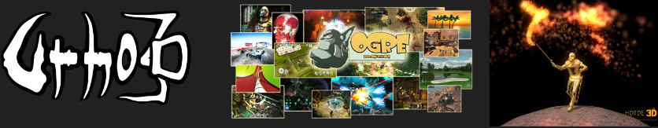
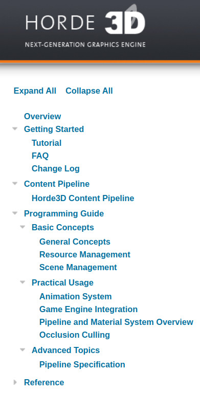

# Engine Investigation

For this portion of the assignment, you are going to review some source code to understand the structure of a game engine. 

**You will be modifying this README.md with your answeres (Search for TODO)**

## Horde3D Graphics Engine

Horde3D is a small and simple graphics engine. It was designed primarily to be integrated with other game engines and frameworks. Some features of the Horde3D engine are:

- It is a small graphics engine that supposedly has a relatively clean API.
- It is cross platform and uses the OpenGL API.
- It specializes in crowd simulation

### Your task

Review the Horde3D reference manual here: http://horde3d.org/docs/manual.html You should read the manual in its entirety such that you can answer the following questions:

- Question: What might be the advantage of a handle-based system?
  - Answer: You get the benefits of a pointer, but with more safety. For example, returns a NULL-Handle in case of failure when constructing object.
    
- Question: What is one pro and one con of creating a C-based API with your engine?
  - Answer:
  - Pro: High portability, fast
  - Con: Tedious / less abstraction and built in functionality than C++ for example
    
- Question: What is a scene graph?
  - Answer: "A scene graph is used to represent the logical or spatial structure of the scene to be rendered. Usually it also serves for accelerating scene-based search and query operations like frustum culling or collision queries." -The Horde3D Documentation
 
    
- Question: What is a Pipeline in Horde3D? In your answer, discuss the purpose of having a 'pipeline XML document' in the context of an engine.
  - Answer:
  - "A pipeline is an XML document that defines the steps to be performed for rendering the scene." -The Horde3D Documentation.
  - The purpose of having the 'pipeline XML document' is to be like a config file.

## GoDot Game Engine

The Godot game engine(https://godotengine.org/) is a free and open-source engine gaining lots of popularity in the past few years. Some features are:

- Cross platform game engine
- Free open source engine

Please read the following article and answer.

- Question: Read the following article (https://godotengine.org/article/why-isnt-godot-ecs-based-game-engine/) and answer in your own words -- how is the GoDot engine organized at a high-level?
  - Answer: Basically an inheritance tree that's very OOP where everything is an object, and there are child classes that contain more classes or components.

## Your Choice Engine/Framework

Pick one game engine that is listed here: https://gist.github.com/raysan5/909dc6cf33ed40223eb0dfe625c0de74

Answer the following to the best of your ability (There may be 1 or 2 that you cannot answer -- if you cannot answer too many questions, choose a different engine to receive full credit.):

- Question: Which engine did you choose?
  - Answer: Unreal Engine
 
    
- Question: Is the engine implemented primarily in C++
  - Answer: Yes
 
    
- Question: Is there a scripting languages available with the engine?
  - Answer: Yes, UnrealScript and Verse
    
- Question: Were there any commercial/indie games made in this engine?
  - Answer: Yes, tons. Gears of War, Fortnite, and more.

    
- Question: What platforms does the engine support?
  - Answer: "Unreal Engine 4 officially supports the following platforms as of 4.27 (August 2021):[97] Windows,[98] macOS,[98] Linux,[98] iOS,[98] Android,[98] Nintendo Switch,[99] PlayStation 4,[100] Xbox One,[100] PlayStation 5,[101] Xbox Series X/S,[101] Stadia,[102] Magic Leap,[103] HTC Vive,[104] Oculus,[105] PlayStation VR,[106] OSVR,[107] Samsung Gear VR,[108] and HoloLens 2.[109] It formerly supported Google Daydream[110] and HTML5.[111][112]" - Unreal Engine Wikepedia page

    
- Question: Were there any Game Developer Conference or other interesting talks? (May need to search YouTube, try to find at least one presentation video or slideshow talking about the technical parts of the engine, code, or a game made with the engine and link it here.)
  - Answer: https://www.youtube.com/watch?v=Dj60HHy-Kqk explains some really amazing features, for example there are 71 million polygons being rendered using nanite.
 
  
- Question: What is the engines 'best' feature (i.e. why do people tend to use it? You may need to visit the website to get an idea.)
  - Answer: High end graphics 
 
    
- Question: Is the code available?
  - Answer: Yes
 
    
- Question: What is one interesting thing you learned looking at the engine or the code, that you think you can implement in your codebase?
  - Answer: Skipping this one because I don't think any of the features mentioned in the videos I watched are things I will be able to implement at my current experience level.
 
    

## Deliverable

1. Modify this readme.md file with your answers.

## F.A.Q

- Q: How long do my answers need to be?
- A: Long enough that your answers are complete -- some can be 'yes/no' answers, but add details. Show your interest!
